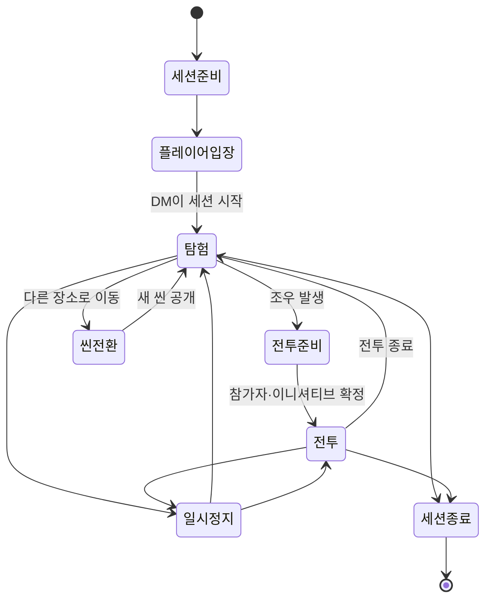

# 02. 핵심 세션 흐름과 플레이 모드

- 상태: 초안
- 작성일: 2026-08-03
- 대상: DM, 플레이어
- 관련 문서:
  - [`AGENTS.md`](../../AGENTS.md)
  - [`README.md`](README.md)
  - [`ADR-0001`](decisions/ADR-0001-authored-rules-content.md)
  - [`ADR-0002`](decisions/ADR-0002-integrated-character-progression.md)
  - [`ADR-0003`](decisions/ADR-0003-ruleset-source-packs-localization.md)

## 1. 문서 목적

이 문서는 RVTT에서 DM과 플레이어가 한 세션을 어떻게 시작하고, 탐험하고, 전투하고, 장면을 전환하고, 종료하는지 수면 위의 흐름을 정의한다.

세부 전투 규칙, 버튼 배치, 데이터 구조와 네트워크 구현은 이 문서에서 확정하지 않는다. 먼저 사용자가 체감하는 모드와 전환 흐름을 명확히 한다.

---

## 2. 핵심 원칙

### 2.1 탐험과 전투는 모두가 공유하는 세션 모드다

현재 세션은 한 번에 `탐험` 또는 `전투` 중 하나의 플레이 모드를 가진다.

모드가 바뀌면 모든 참가자의 UI, 입력 가능 범위, 이동 규칙과 행동 처리 방식이 함께 바뀐다.

### 2.2 빠른 편집은 세션 모드가 아니다

`빠른 편집`은 탐험이나 전투 위에서 DM만 잠시 켜는 작업 오버레이다.

DM이 빠른 편집을 켠다고 플레이어의 탐험이나 전투가 별도의 편집 모드로 전환되지는 않는다. 플레이어는 현재 플레이 모드를 계속 본다.

### 2.3 전체 씬 편집은 플레이와 분리한다

`씬 편집`은 장면의 구조를 만드는 전체 편집 작업 공간이다.

플레이 중 전체 씬 편집이 필요하면 세션을 일시정지하고 플레이어 입력을 잠근 뒤 편집한다. 플레이어가 움직이는 가운데 벽, 충돌, 시야 구조와 대규모 지형을 동시에 수정하지 않는다.

### 2.4 탐험과 전투 전환은 씬 재로딩이 아니다

같은 씬, 같은 토큰, 같은 HP, 같은 상태 효과와 같은 오브젝트 상태를 유지한 채 플레이 규칙만 전환한다.

전투가 끝나면 별도 맵을 다시 불러오지 않고 현재 위치에서 탐험으로 복귀한다.

### 2.5 DM은 언제나 최종 진행 권한을 가진다

DM은 다음을 최종 확정한다.

- 플레이 모드 전환
- 세션 일시정지와 재개
- 활성 씬과 씬 전환
- 전투 참가자와 전투 종료
- 숨겨진 정보와 공개 범위
- 빠른 편집과 씬 편집의 변경사항
- 자동 판정의 수정과 예외 처리

---

## 3. 상태를 세 축으로 분리한다

모든 상태를 하나의 `Mode` 값으로 묶지 않는다.

### 3.1 세션 생명주기

| 상태 | 의미 |
|---|---|
| 준비 | DM이 세션, 씬과 참가자를 준비하고 아직 플레이를 시작하지 않은 상태 |
| 진행 | 플레이어가 탐험 또는 전투를 진행하는 상태 |
| 일시정지 | 현재 상태를 보존한 채 플레이 입력과 시간 진행을 멈춘 상태 |
| 종료 | 현재 세션 결과를 저장하고 라이브 진행을 마친 상태 |

### 3.2 공유 플레이 모드

| 모드 | 의미 |
|---|---|
| 탐험 | 자유로운 이동, 조사, 대화, 상호작용과 비전투 행동 중심 |
| 전투 | 이니셔티브, 턴, 행동 경제, 이동력과 반응 행동 중심 |

### 3.3 DM 작업 상태

| 작업 상태 | 플레이어에게 미치는 영향 |
|---|---|
| 진행 조작 | 일반적인 DM 진행 상태 |
| 빠른 편집 | 현재 플레이 모드를 유지한 채 DM만 라이브 씬을 수정 |
| 씬 편집 | 세션을 일시정지하고 장면 구조를 전면 편집 |

따라서 다음 조합이 가능하다.

```text
탐험 + DM 진행 조작
탐험 + DM 빠른 편집
전투 + DM 진행 조작
전투 + DM 빠른 편집
일시정지 + DM 씬 편집
```

`전투 + 전체 씬 편집`처럼 서로 충돌하는 조합은 허용하지 않는다.

---

## 4. 전체 세션 흐름



### 4.1 세션 준비

DM은 세션 시작 전에 다음을 확인한다.

- 캠페인과 규칙 세트
- 활성 출처 팩
- 시작 씬
- 플레이어별 캐릭터와 소유권
- 시작 위치 또는 파티 배치
- 현재 HP, 자원과 장비 상태
- 비공개 토큰과 숨겨진 오브젝트
- 필요한 핸드아웃, 음악과 씬 연출

DM은 아직 플레이어에게 공개되지 않은 씬을 비공개로 준비할 수 있다.

### 4.2 플레이어 입장

플레이어는 다음 순서로 세션에 들어온다.

1. 캠페인 세션에 접속한다.
2. 자신에게 허용된 캐릭터를 선택한다.
3. 캐릭터 시트와 최근 저장 상태를 확인한다.
4. DM의 시작 승인을 기다린다.
5. DM이 활성 씬을 공개하면 해당 씬에 배치된다.

플레이어가 늦게 참가해도 현재 씬과 세션 상태를 동기화하여 합류할 수 있어야 한다.

### 4.3 세션 시작

DM이 `세션 시작`을 누르면 다음이 일어난다.

- 시작 씬이 플레이어에게 공개된다.
- 플레이어 토큰이 지정된 위치에 배치된다.
- 탐험 모드가 활성화된다.
- 탐험 UI와 허용된 입력이 열린다.
- 씬의 음악, 조명, 날씨와 공개 연출이 시작된다.

### 4.4 탐험 진행

플레이어는 자신의 캐릭터로 이동, 조사, 상호작용, 능력 사용과 대화를 수행한다.

DM은 NPC와 환경을 조작하고, 정보를 공개하고, 판정을 요청하고, 장면의 사건을 진행한다.

전투가 발생하지 않는 한 이니셔티브와 턴 순서는 표시하지 않는다.

### 4.5 전투 진입

DM이 `전투 시작`을 선택하면 즉시 첫 턴으로 넘어가지 않고 짧은 전투 준비 단계를 거친다.

1. 일반 이동 입력을 잠시 멈춘다.
2. 전투 참가자를 선택하거나 자동 감지 결과를 확인한다.
3. 기습, 숨김, 전투 시작 조건을 확인한다.
4. 이니셔티브를 굴리거나 기존 값을 입력한다.
5. 참가자 순서와 시작 위치를 검토한다.
6. DM이 확정하면 전투 모드를 시작한다.

씬과 토큰 위치는 그대로 유지된다.

### 4.6 전투 진행

전투 중에는 다음이 활성화된다.

- 이니셔티브 순서
- 현재 턴 표시
- 이동력과 이동 경로
- 행동, 보너스 행동과 반응 행동
- 공격, 주문과 특성의 대상 지정
- 상태 효과와 지속시간
- 집중, 자원과 턴당 사용 횟수
- 전투 로그와 판정 결과

플레이어는 자신의 캐릭터가 가진 실행 가능한 행동을 시트에서 자동으로 받아 사용한다.

DM은 NPC와 몬스터를 조작하고, 자동 처리 결과를 검토하고, 필요한 경우 예외를 판정한다.

### 4.7 전투 종료

DM이 전투 종료를 확정하면 다음을 처리한다.

1. 전투 종료 조건을 확인한다.
2. 전투에만 필요한 턴 상태를 정리한다.
3. 전투 종료 시 발동하는 효과를 처리한다.
4. 지속되는 상태와 집중 효과는 유지한다.
5. 쓰러진 캐릭터, 사망, 포로와 도주 상태를 확인한다.
6. 전투 결과 요약을 기록한다.
7. 현재 위치에서 탐험 모드로 복귀한다.

전투 종료가 자동으로 HP나 사용한 자원을 회복시키지는 않는다.

### 4.8 씬 전환

DM은 다음 씬을 플레이어에게 공개하기 전에 비공개로 불러오고 확인할 수 있다.

씬 전환 시 기본 흐름은 다음과 같다.

1. DM이 목적 씬을 선택한다.
2. 플레이어에게 로딩 또는 전환 연출을 표시한다.
3. 현재 씬의 런타임 상태를 저장한다.
4. 목적 씬과 공개 상태를 동기화한다.
5. 파티 토큰을 지정된 진입 지점에 배치한다.
6. 플레이어 카메라와 UI를 새 씬에 맞춘다.
7. 탐험을 재개한다.

전투 상태를 유지한 채 씬을 전환하는 기능은 별도 세부 기획에서 결정한다.

### 4.9 세션 종료

DM이 세션 종료를 선택하면 다음을 확인한다.

- 캐릭터 현재 상태 저장
- 씬별 런타임 상태 저장
- 인벤토리와 자원 변경 저장
- 퀘스트, 핸드아웃과 공개 정보 저장
- 빠른 편집 변경사항의 유지 또는 폐기
- 세션 로그와 요약 저장

저장이 끝나기 전에 세션이 종료된 것처럼 표시하지 않는다.

---

## 5. 탐험 모드

### 5.1 플레이어 흐름

플레이어는 탐험 모드에서 다음 행동을 수행한다.

- 자신의 토큰 선택과 이동
- 시야 안의 오브젝트와 토큰 확인
- 문, 상자, 레버, 사다리와 같은 오브젝트와 상호작용
- 조사, 지각, 은신과 같은 판정 요청 또는 실행
- 전투 밖에서 사용할 수 있는 주문과 특성 사용
- 캐릭터 시트, 인벤토리, 주문과 메모 열람
- 위치 핑과 거리 측정
- DM이 공개한 핸드아웃 확인

탐험 UI는 전투 UI보다 단순해야 한다. 이니셔티브, 턴 자원과 이동력 표시는 기본적으로 숨긴다.

### 5.2 DM 흐름

DM은 탐험 모드에서 다음을 수행한다.

- NPC와 비공개 토큰 이동
- 플레이어별 정보 공개와 숨김
- 문, 함정, 조명과 환경 상태 변경
- 판정 요청과 결과 적용
- 대화, 핸드아웃, 음악과 연출 실행
- 씬 전환
- 전투 시작
- 필요할 때 빠른 편집 진입

### 5.3 탐험 이동 정책

탐험 모드는 자유 이동을 기본으로 설계하되, DM이 씬 또는 상황별로 이동 정책을 바꿀 수 있게 한다.

후보 정책:

- 자유 이동
- 이동 요청 후 DM 승인
- 파티 대표 토큰 추종
- 모든 플레이어 이동 잠금

기본 정책과 세부 조작 방식은 후속 기획에서 확정한다.

---

## 6. 전투 모드

### 6.1 플레이어 흐름

플레이어의 기본 전투 흐름은 다음과 같다.

1. 자신의 턴이 오면 알림을 받는다.
2. 현재 이동력, 행동과 자원을 확인한다.
3. 이동하거나 행동을 선택한다.
4. 대상 또는 지점을 지정한다.
5. 예상 범위와 유효 조건을 확인한다.
6. 실행을 확정한다.
7. 서버 판정과 결과를 확인한다.
8. 추가 행동이 있으면 계속 진행한다.
9. 턴 종료를 확정한다.

시스템은 사용할 수 없는 행동을 숨기거나 비활성화하고 이유를 보여준다.

### 6.2 턴 밖의 플레이어 흐름

플레이어는 자신의 턴이 아니어도 다음을 수행할 수 있다.

- 캐릭터 시트와 전장 확인
- 허용된 카메라 이동
- 핑과 측정
- 준비된 반응 행동에 응답
- DM이 요청한 내성 굴림이나 선택지 처리
- 로그와 효과 설명 확인

다른 플레이어의 턴을 방해하는 이동과 일반 행동은 허용하지 않는다.

### 6.3 DM 흐름

DM은 전투 모드에서 다음을 수행한다.

- NPC와 몬스터 턴 실행
- 전투 참가자 추가와 제거
- 이니셔티브 순서 수정
- 숨겨진 적과 기습 처리
- 자동 판정 승인 또는 수정
- 피해, 상태와 자원 수동 조정
- 환경 턴과 함정 처리
- 전투 일시정지
- 빠른 편집 진입
- 전투 종료

DM의 수동 수정은 구조화된 로그에 남겨야 한다.

---

## 7. DM 빠른 편집

### 7.1 목적

빠른 편집은 세션 흐름을 끊지 않고 현장에서 필요한 작은 변경을 수행하기 위한 기능이다.

예시:

- 빠진 문이나 상자 배치
- 토큰과 소품 이동
- 즉석 적 증원 배치
- 문 열림 상태 수정
- 조명 켜기와 끄기
- 플레이어에게 보일 오브젝트 공개
- 작은 장애물과 위험 지대 배치
- 잘못 배치된 오브젝트 삭제

### 7.2 진입과 종료

DM은 하나의 명확한 버튼 또는 단축키로 빠른 편집을 켜고 끈다.

진입 시:

- DM의 선택 도구가 편집 선택으로 전환된다.
- 빠른 배치 도구와 최소한의 속성 패널이 열린다.
- 플레이어의 현재 모드는 유지된다.

종료 시:

- DM의 일반 진행 입력으로 즉시 돌아간다.
- 선택 중인 편집 작업을 확정하거나 취소한다.
- 변경사항은 빠른 편집 기록에 남는다.

### 7.3 허용 범위

빠른 편집에서 우선 허용한다.

- 토큰과 프리팹 배치
- 오브젝트 선택, 이동, 회전과 삭제
- 가시성 변경
- 문과 조명 상태 변경
- 간단한 영역과 위험 지대 배치
- 오브젝트의 제한된 런타임 속성 수정
- 실행 취소와 다시 실행

### 7.4 금지 또는 제한 범위

빠른 편집에서 다음 작업은 수행하지 않는다.

- 대규모 지형 재구성
- 씬 전체 크기와 좌표계 변경
- 시야 벽과 충돌 구조의 광범위한 수정
- 출처 팩과 규칙 콘텐츠 관리
- 저장 스키마 변경
- 다른 씬의 전면 편집
- 플레이어가 사용 중인 핵심 오브젝트의 파괴적 변경

이 작업은 전체 씬 편집으로 전환한다.

### 7.5 라이브 패치 레이어

빠른 편집은 기본 씬 원본을 직접 덮어쓰지 않고 `라이브 패치`로 기록한다.

라이브 패치는 다음 중 하나로 종료할 수 있다.

- 현재 세션 상태로 유지
- 기본 씬에 반영하도록 승격
- 선택한 변경만 되돌리기
- 세션 종료 시 폐기

기본 지속 정책은 후속 기획에서 확정한다.

---

## 8. DM 전체 씬 편집

### 8.1 목적

씬 편집은 플레이할 공간 자체를 제작하고 구조적으로 수정하는 전체 편집 작업 공간이다.

### 8.2 진입 조건

씬 편집은 다음 상황에서 사용한다.

- 세션 시작 전 준비
- 플레이어가 없는 별도 준비 시간
- 라이브 세션을 명시적으로 일시정지한 상태

라이브 세션 중 진입하면:

1. 현재 탐험 또는 전투 상태를 보존한다.
2. 플레이어의 이동과 행동 입력을 잠근다.
3. 플레이어에게 일시정지 상태를 표시한다.
4. DM이 전체 씬 편집을 시작한다.

### 8.3 편집 범위

씬 편집에서는 다음을 다룬다.

- 지형과 건축물
- 벽, 바닥, 계단과 고저차
- 충돌과 이동 가능 영역
- 시야 벽, 문과 Fog of War 구조
- 조명, 환경광, 날씨와 하늘
- 그리드, 거리 단위와 높이 기준
- 토큰과 오브젝트 시작 배치
- 플레이어 진입 지점
- 트리거, 영역과 환경 상호작용
- 씬 레이어와 오브젝트 그룹
- 씬 이름, 설명, 음악과 메타데이터
- 성능 점검과 최적화 정보

### 8.4 저장과 공개

씬 편집 결과는 먼저 `편집 초안`에 저장한다.

DM이 검토한 뒤 `라이브 씬에 적용`을 선택해야 현재 세션 또는 다음 세션에 반영된다.

반영 전에는 플레이어가 불완전한 중간 상태를 보지 않는다.

### 8.5 종료와 재개

씬 편집을 종료할 때 다음을 수행한다.

1. 변경사항 저장 또는 폐기 선택
2. 씬 유효성 검사
3. 플레이어 토큰과 중요 오브젝트 충돌 확인
4. 라이브 씬에 적용
5. 기존 탐험 또는 전투 상태 복원
6. 플레이어 입력 잠금 해제
7. 세션 재개

---

## 9. 씬의 세 가지 상태 레이어

씬 데이터를 다음 세 층으로 구분하는 방향을 제안한다.

### 9.1 기본 씬

DM이 전체 씬 편집에서 제작하고 공개한 장면 원본이다.

예시:

- 건물과 지형
- 기본 문과 조명
- 시야 구조
- 시작 배치
- 환경 설정

### 9.2 런타임 상태

플레이 도중 자연스럽게 변한 상태다.

예시:

- 열린 문
- 꺼진 횃불
- 파괴된 상자
- 이동한 토큰
- 발견된 함정
- 남겨진 시체와 전리품

### 9.3 라이브 패치

DM이 빠른 편집으로 추가하거나 수정한 임시 장면 변경이다.

예시:

- 즉석 바리케이드
- 추가 적 토큰
- 급히 배치한 소품
- 수정된 조명
- 임시 위험 지역

세 층을 분리하면 세션 변화와 장면 원본 수정이 뒤섞이지 않는다.

---

## 10. 일시정지

일시정지는 탐험이나 전투를 폐기하지 않고 잠시 멈추는 세션 제어 상태다.

일시정지 중에는:

- 토큰 이동 금지
- 행동 실행 금지
- 턴과 지속시간 진행 중지
- 플레이어에게 명확한 일시정지 표시
- 캐릭터 시트와 로그 열람 허용
- DM의 상태 확인과 전체 씬 편집 허용

DM이 재개하면 이전 탐험 또는 전투 모드로 돌아간다.

---

## 11. 모드 전환 규칙

### 탐험 → 전투

- DM만 확정 가능
- 전투 준비 단계 필수
- 토큰 위치와 씬 상태 유지
- 일반 이동을 전투 이동으로 전환
- 전투 UI 활성화

### 전투 → 탐험

- DM만 확정 가능
- 전투 종료 처리 후 전환
- 지속 효과와 현재 위치 유지
- 턴 UI 종료
- 탐험 입력 복원

### 탐험 또는 전투 → 빠른 편집

- 공유 플레이 모드는 바뀌지 않음
- DM UI와 입력만 변경
- 변경은 라이브 패치 기록에 남음

### 탐험 또는 전투 → 씬 편집

- 세션 일시정지 필수
- 플레이어 입력 잠금
- 전체 편집 후 유효성 검사와 공개 필요

### 일시정지 → 기존 모드

- 일시정지 직전 모드를 기억
- 검증되지 않은 편집 변경이 있으면 재개 차단
- 동기화 완료 후 플레이어 입력 복원

---

## 12. 화면 수준의 기본 방향

상세 UI 설계 전 다음 원칙만 고정한다.

### 플레이어

- 탐험에서는 화면을 가볍게 유지한다.
- 전투에서는 현재 턴, 이동력, 행동과 자원을 명확히 보여준다.
- 캐릭터 시트는 두 모드에서 모두 열 수 있다.
- 모드가 바뀌면 필요한 UI만 자연스럽게 추가하거나 제거한다.
- 편집 도구와 DM 전용 정보는 노출하지 않는다.

### DM

- 현재 세션 상태, 활성 씬과 플레이 모드를 항상 확인할 수 있다.
- `탐험`, `전투 시작`, `전투 종료`, `일시정지`가 명확히 구분된다.
- 빠른 편집은 한 번의 입력으로 진입하고 나올 수 있다.
- 전체 씬 편집은 실수로 진입하지 않도록 별도 확인 절차를 둔다.
- 숨겨진 토큰과 플레이어별 시야를 DM이 구분해서 볼 수 있다.

---

## 13. 확정된 방향

이 문서에서 우선 확정할 방향은 다음과 같다.

1. 탐험과 전투는 모두가 공유하는 핵심 플레이 모드다.
2. 빠른 편집은 DM 전용 오버레이이며 플레이 모드를 바꾸지 않는다.
3. 전체 씬 편집은 플레이와 분리하며 라이브 중에는 일시정지가 필요하다.
4. 탐험과 전투 전환 시 씬과 토큰을 다시 불러오지 않는다.
5. 전투 시작 전 전투 참가자와 이니셔티브를 확인하는 준비 단계가 있다.
6. 전투 종료 후 현재 위치에서 탐험으로 돌아간다.
7. 빠른 편집 변경은 기본 씬과 분리된 라이브 패치로 관리한다.
8. 플레이 중 변경된 문, 조명과 오브젝트 상태는 런타임 상태로 관리한다.
9. DM만 공유 플레이 모드와 활성 씬을 최종 전환할 수 있다.
10. 플레이어는 모드에 맞는 최소 UI만 본다.

---

## 14. 후속 결정이 필요한 항목

다음은 이 문서에서 아직 확정하지 않는다.

1. 탐험 기본 이동 정책
2. 빠른 편집 변경사항의 기본 지속 여부
3. 전투 중 씬 전환 지원 범위
4. 플레이어가 일시정지 중 사용할 수 있는 기능
5. 전체 씬 편집 중 플레이어 화면 처리
6. 전투 참가자 자동 감지 기준
7. 탐험 중 주문과 특성의 행동 비용 표시 방식
8. 자유 카메라, 토큰 추적 카메라와 DM 카메라 정책
9. 씬 전환 시 파티 배치 방식
10. 빠른 편집에서 허용할 시야 벽과 충돌 수정 범위

다음 단계에서는 탐험 모드의 이동, 상호작용, 시야와 DM 진행 흐름부터 세부화한다.
