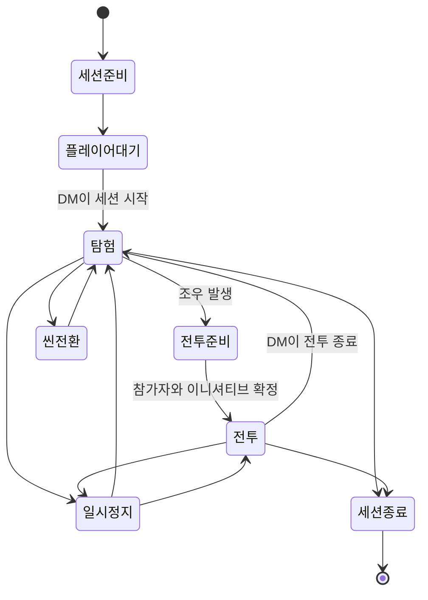

# 02. 핵심 세션 흐름과 플레이 모드

- 상태: 초안
- 작성일: 2026-08-03
- 대상: DM, 플레이어
- 관련 문서:
  - [`AGENTS.md`](../../../AGENTS.md)
  - [`README.md`](../../README.md)
  - [`ADR-0001`](../../decisions/ADR-0001-authored-rules-content.md)
  - [`ADR-0002`](../../decisions/ADR-0002-integrated-character-progression.md)
  - [`ADR-0003`](../../decisions/ADR-0003-ruleset-source-packs-localization.md)
  - [`ADR-0004`](../../decisions/ADR-0004-baldurs-gate-style-session-interaction.md)
  - [`ADR-0005`](../../decisions/ADR-0005-performance-reliability-clean-code.md)
  - [`ADR-0006`](../../decisions/ADR-0006-rigless-3d-token-continuous-movement.md)
  - [`04. 장면과 월드`](../../systems/scene/scenes-and-world.md)

## 1. 문서 목적

이 문서는 RVTT에서 DM과 플레이어가 한 세션을 어떻게 시작하고, 탐험하고, 전투하고, 장면을 전환하고, 종료하는지 정의한다.

수면 위 제품 목표는 다음과 같다.

> RVTT는 DM이 실시간으로 진행하는 발더스 게이트형 D&D 세션이다.

플레이어는 복잡한 VTT 도구를 조작하는 대신 전술 RPG를 플레이하듯 캐릭터를 선택하고, 이동하고, 상호작용하고, 행동한다. DM은 같은 장면에서 NPC, 숨겨진 정보, 판정, 전투와 즉석 수정을 통제한다.

이 문서에서는 사용자 흐름과 모드 경계를 다룬다. 구체적인 버튼 위치, 키 배치, 데이터 타입과 네트워크 API는 후속 문서에서 정한다.

---

## 2. 핵심 원칙

### 2.1 탐험과 전투는 공유 플레이 모드다

현재 세션은 한 번에 `탐험` 또는 `전투` 중 하나의 공유 플레이 모드를 가진다.

모드가 바뀌면 모든 참가자의 UI, 입력 제한, 이동 규칙과 행동 처리가 함께 바뀐다.

### 2.2 탐험과 전투는 같은 장면을 사용한다

모드 전환은 씬 재로딩이 아니다.

- 토큰 위치 유지
- HP와 자원 유지
- 문과 오브젝트 상태 유지
- 집중과 지속 효과 유지
- 카메라가 보고 있던 장면 유지

전투가 끝나면 현재 위치에서 탐험으로 돌아간다.

### 2.3 토큰은 연속 좌표로 이동한다

캐릭터와 몬스터는 Roblox 아바타가 아니라 OBJ 또는 MeshPart 기반의 3D 미니어처 토큰이다.

토큰은 Humanoid와 걷기 애니메이션을 사용하지 않으며, 이동 시스템이 승인한 경로를 따라 피벗이 부드럽게 이동한다.

기본 위치는 5피트 칸 중심에 고정하지 않는다. D&D 거리와 이동 비용은 피트 단위로 계산하고, 5피트 격자는 선택적 시각 오버레이로만 사용한다.

### 2.4 카메라는 토큰과 분리된다

플레이어와 DM은 자유 전술 카메라를 사용한다.

카메라를 이동해도 캐릭터 위치, 시야 권한과 공개 정보는 바뀌지 않는다.

### 2.5 이동 입력은 둘이지만 이동 시스템은 하나다

플레이어는 다음 두 방식을 선택할 수 있다.

- 목적지를 클릭하는 이동
- 선택한 캐릭터를 WASD로 직접 움직이는 이동

두 방식은 같은 이동 가능 표면, 경로, 이동 비용, 차단 영역, 험지, 토큰 점유와 서버 검증을 사용한다.

### 2.6 빠른 편집은 DM 오버레이다

빠른 편집은 탐험이나 전투 위에서 DM만 켜는 작업 상태다.

DM이 빠른 편집을 사용해도 플레이어의 공유 플레이 모드는 바뀌지 않는다.

### 2.7 전체 씬 편집은 플레이와 분리한다

벽, 이동 가능 표면, 차단 영역, 시야 구조와 대규모 지형을 편집할 때는 세션을 일시정지한다.

플레이어가 움직이는 동안 장면의 구조를 전면 수정하지 않는다.

### 2.8 성능과 안정성은 완료 조건이다

모든 기능은 정상 동작뿐 아니라 다음을 함께 만족해야 한다.

- 장시간 세션에서 안정적인 성능
- 명확한 책임과 수정 가능한 코드 구조
- 실패가 전체 세션으로 퍼지지 않는 오류 처리
- 저장, 재접속과 씬 전환에서 상태 복구
- 프로파일링과 검증 가능한 완료 기준

---

## 3. 상태를 세 축으로 분리한다

모든 상황을 하나의 `Mode` 값으로 묶지 않는다.

### 3.1 세션 생명주기

| 상태 | 의미 |
|---|---|
| 준비 | DM이 세션과 씬을 준비하고 시작을 승인하기 전 |
| 진행 | 탐험 또는 전투가 진행 중 |
| 일시정지 | 상태를 보존한 채 플레이 입력과 시간 진행을 정지 |
| 종료 | 세션 결과를 저장하고 라이브 진행을 마침 |

### 3.2 공유 플레이 모드

| 모드 | 중심 경험 |
|---|---|
| 탐험 | 이동, 조사, 대화, 상호작용과 비전투 능력 |
| 전투 | 이니셔티브, 턴, 이동력, 행동과 반응 |

### 3.3 DM 작업 상태

| 상태 | 의미 |
|---|---|
| 진행 조작 | NPC, 환경, 판정과 정보 공개를 관리 |
| 빠른 편집 | 현재 플레이 위에서 작은 라이브 변경 수행 |
| 씬 편집 | 세션을 멈추고 장면 구조를 전면 편집 |

가능한 조합:

```text
탐험 + DM 진행 조작
탐험 + DM 빠른 편집
전투 + DM 진행 조작
전투 + DM 빠른 편집
일시정지 + DM 씬 편집
```

`전투 진행 + 전체 씬 편집`처럼 충돌하는 조합은 허용하지 않는다.

---

## 4. 전체 세션 흐름



## 5. 세션 준비와 입장

### 5.1 DM 준비

DM은 세션 시작 전에 다음을 확인한다.

- 캠페인과 `dnd5e-2024` 규칙 세트
- 활성 출처 팩
- 시작 씬과 플레이어 진입 지점
- 캐릭터 소유권
- 현재 HP, 자원, 장비와 장기 상태
- 비공개 토큰과 숨겨진 오브젝트
- 음악, 핸드아웃과 시작 연출
- 씬의 이동 가능 표면, 차단 영역, 험지와 오류 검사 결과

### 5.2 플레이어 입장

1. 세션에 접속한다.
2. 자신에게 허용된 캐릭터를 선택한다.
3. 캐릭터 시트와 최근 저장 상태를 확인한다.
4. DM의 시작을 기다린다.
5. 시작 승인 후 활성 씬과 현재 상태를 동기화한다.

늦게 참가한 플레이어도 서버의 현재 상태를 기준으로 합류한다.

### 5.3 세션 시작

DM이 시작하면:

- 시작 씬 공개
- 플레이어 토큰 배치
- 탐험 모드 활성화
- 카메라와 탐험 UI 준비
- 음악, 조명, 날씨와 공개 연출 시작

저장 또는 씬 동기화가 실패했다면 정상 시작으로 표시하지 않는다.

---

## 6. 탐험 모드

### 6.1 기본 경험

탐험은 자유로운 전술 카메라와 캐릭터 이동을 중심으로 진행한다.

플레이어는 다음을 수행한다.

- 자신의 캐릭터 선택
- 카메라 이동, 회전, 확대와 축소
- 클릭 또는 WASD로 이동
- 문, 상자, 레버와 환경 상호작용
- 조사, 지각, 은신과 판정
- 비전투 주문과 특성 사용
- 시트, 인벤토리, 주문과 메모 열람
- 핑과 거리 측정
- 공개된 핸드아웃 확인

탐험 UI에는 이니셔티브와 턴 자원을 기본적으로 표시하지 않는다.

### 6.2 자유 카메라

카메라는 토큰에 고정되지 않는다.

기본적으로 다음을 지원한다.

- 평면 이동
- 회전
- 확대와 축소
- 높이 조절
- 선택한 캐릭터로 초점 이동
- 선택한 캐릭터 추적 켜기와 끄기
- 시야를 가리는 벽과 지붕의 표시 보정

카메라가 이동한 영역에 비공개 토큰과 미발견 정보가 있다고 해서 플레이어에게 보여주지 않는다.

### 6.3 클릭 이동

1. 캐릭터를 선택한다.
2. 이동 가능한 표면의 목적 위치에 마우스를 올린다.
3. 경로, 거리, 험지 비용과 도달 가능 여부를 본다.
4. 목적지를 클릭한다.
5. 서버 검증 후 승인된 경로를 따라 토큰 피벗이 이동한다.

탐험에서는 이동력 제한이 없지만 다음 상황에서 이동이 멈출 수 있다.

- 문과 장애물
- 상호작용 지점
- 함정과 이벤트
- 전투 진입
- DM 이동 잠금
- 서버가 감지한 경로 변화

### 6.4 WASD 직접 이동

WASD 입력은 선택한 토큰을 현재 방향으로 조금 이동하려는 연속 이동 의도로 처리한다.

- 토큰 모델을 물리 캐릭터처럼 보행시키지 않는다.
- 짧은 다음 위치마다 이동 가능 표면, 차단 영역과 비용을 검사한다.
- 클릭 이동과 같은 이동 판정과 서버 검증을 거친다.
- 카메라는 따라가기 또는 분리 상태를 선택할 수 있다.

### 6.5 조작 방식 전환

클릭 이동과 WASD 이동은 플레이어 개인 설정이다.

- 탐험과 전투 모두에서 사용 가능
- 세션 상태를 바꾸지 않음
- 위치와 경로 상태를 유지한 채 즉시 전환
- 같은 이동 파이프라인 사용

클릭 이동 설정에서는 WASD를 카메라 이동에 사용할 수 있다. 직접 이동 설정에서의 정확한 카메라 키는 입력 문서에서 정한다.

### 6.6 탐험 이동 정책

기본 정책은 플레이어가 자신의 토큰을 자유롭게 이동하는 것이다.

DM은 상황별로 다음을 사용할 수 있다.

- 전체 이동 잠금
- 특정 플레이어 또는 토큰만 이동 허용
- 컷신 또는 판정 중 임시 잠금
- 강제 위치 복구

이동 요청을 매번 DM이 승인하는 방식을 기본으로 사용하지 않는다. 세션 진행을 느리게 만들기 때문이다.

### 6.7 DM 탐험 흐름

DM은 다음을 수행한다.

- NPC와 숨겨진 토큰 조작
- 플레이어별 정보 공개와 숨김
- 문, 함정, 조명과 환경 상태 변경
- 판정 요청과 결과 적용
- 대화, 음악, 핸드아웃과 연출
- 이동 잠금과 강제 위치 조정
- 전투 시작
- 씬 전환
- 빠른 편집

---

## 7. 전투 진입과 전투 모드

### 7.1 전투 준비

DM이 전투 시작을 선택하면 즉시 첫 턴으로 넘어가지 않는다.

1. 탐험 이동 잠금
2. 전투 참가자 선택 또는 자동 감지 결과 확인
3. 기습, 은신과 시작 조건 확인
4. 이니셔티브 굴림
5. 참가자 순서와 시작 위치 검토
6. DM 확정
7. 전투 모드 시작

씬과 토큰 위치는 유지한다.

### 7.2 전투 중 이동

클릭과 WASD 입력은 탐험과 같은 이동 시스템을 사용한다.

전투에서는 추가로 다음을 검증한다.

- 현재 턴과 조작 권한
- 남은 이동력
- 실제 경로 길이와 지형 비용
- 어려운 지형과 상태 효과
- 반응 행동과 이동 중단
- 다른 토큰의 점유와 통과 규칙

이동 경로와 소비량을 실행 전에 보여준다.

### 7.3 플레이어 턴 흐름

1. 턴 알림을 받는다.
2. 남은 이동력, 행동과 자원을 확인한다.
3. 이동 또는 행동을 선택한다.
4. 대상, 지점 또는 경로를 지정한다.
5. 사거리, 범위와 유효 조건을 확인한다.
6. 실행을 확정한다.
7. 서버 판정과 결과를 확인한다.
8. 남은 행동을 수행한다.
9. 턴 종료를 확정한다.

사용할 수 없는 행동은 이유와 함께 비활성화한다.

### 7.4 턴 밖 행동

플레이어는 자신의 턴이 아니어도 다음을 할 수 있다.

- 자유 카메라로 전장 확인
- 시트와 로그 열람
- 핑과 거리 측정
- 반응 행동 응답
- DM이 요청한 내성 굴림과 선택 처리

일반 이동과 행동은 허용하지 않는다.

### 7.5 DM 전투 흐름

DM은 다음을 수행한다.

- NPC와 몬스터 턴
- 참가자 추가와 제거
- 이니셔티브 수정
- 숨겨진 적과 기습 처리
- 자동 판정 검토와 예외 처리
- 피해, 상태와 자원 수동 조정
- 환경 턴과 함정
- 전투 일시정지
- 빠른 편집
- 전투 종료

강제 이동, 순간이동과 수동 수정은 일반 행동과 구분해 로그에 남긴다.

### 7.6 전투 종료

1. 전투 종료 조건 확인
2. 전투 종료 시 효과 처리
3. 턴 전용 상태 정리
4. 지속 상태와 집중 효과 유지
5. 쓰러짐, 사망, 도주와 포로 상태 확인
6. 결과 기록
7. 현재 위치에서 탐험 복귀

전투 종료는 HP와 사용한 자원을 자동 회복하지 않는다.

---

## 8. DM 빠른 편집

### 8.1 목적

세션 흐름을 끊지 않고 현장에서 작은 변경을 수행한다.

예시:

- 토큰과 소품 배치
- 오브젝트 이동, 회전과 삭제
- 적 증원 배치
- 문과 조명 상태 수정
- 오브젝트 공개와 숨김
- 작은 장애물과 위험 지역 배치
- 임시 험지 영역 배치
- 잘못된 이동 판정 복구

### 8.2 진입과 종료

빠른 편집은 한 번의 명확한 입력으로 켜고 끈다.

진입 시 DM 입력과 최소 편집 UI만 바뀐다. 플레이어의 탐험 또는 전투는 유지된다.

종료 시 진행 조작으로 돌아가며, 확정된 변경을 라이브 패치에 기록한다.

### 8.3 허용 범위

- 토큰과 프리팹 배치
- 선택, 이동, 회전과 삭제
- 제한된 런타임 속성 수정
- 문, 조명과 가시성 변경
- 임시 차단 영역, 험지와 위험 지대 배치
- 실행 취소와 다시 실행

### 8.4 제한 범위

다음은 전체 씬 편집에서 수행한다.

- 대규모 지형 수정
- 씬 좌표계와 전체 크기 변경
- 이동 가능 표면과 차단 구조의 광범위한 수정
- 시야 벽의 광범위한 수정
- 다른 씬 전면 편집
- 규칙 콘텐츠와 출처 팩 관리
- 플레이 중인 핵심 구조의 파괴적 변경

### 8.5 라이브 패치

빠른 편집은 기본 씬을 즉시 덮어쓰지 않는다.

변경은 별도 라이브 패치에 기록하며, 세션 종료 시 다음 중 하나를 선택한다.

- 런타임 상태로 유지
- 기본 씬에 승격
- 선택 변경 되돌리기
- 전체 폐기

기본 지속 정책은 후속 저장 문서에서 확정한다.

---

## 9. DM 전체 씬 편집

전체 씬 편집은 플레이 공간 자체를 제작하고 구조적으로 수정하는 작업 공간이다.

### 9.1 진입 조건

- 세션 시작 전
- 플레이어가 없는 준비 시간
- 라이브 세션을 일시정지한 상태

라이브 중에는 플레이어 입력을 잠그고 현재 탐험 또는 전투 상태를 보존한다.

### 9.2 편집 범위

- 지형과 건축물
- 벽, 바닥, 계단과 고저차
- 이동 가능 표면, 차단 영역과 험지 영역
- 표면 연결과 동적 문 상태
- 시야 벽, 문과 Fog of War
- 조명, 날씨와 환경
- 시작 배치와 진입 지점
- 트리거와 상호작용 영역
- 씬 레이어와 오브젝트 그룹
- 음악과 메타데이터
- 성능 예산과 오류 검사

### 9.3 저장과 공개

1. 편집 초안 저장
2. 이동 판정, 시야와 참조 유효성 검사
3. 성능 경고 확인
4. 라이브 씬 적용 승인
5. 플레이어 상태 동기화
6. 기존 모드 복귀

플레이어는 불완전한 편집 중간 상태를 보지 않는다.

---

## 10. 씬 상태의 세 레이어

### 10.1 기본 씬

전체 씬 편집으로 제작하고 승인한 원본이다.

- 지형과 건물
- 기본 문과 조명
- 이동 의미와 시야 구조
- 시작 배치
- 환경 설정

### 10.2 런타임 상태

플레이 결과로 바뀐 상태다.

- 열린 문
- 꺼진 횃불
- 파괴된 오브젝트
- 이동한 토큰
- 발견된 함정
- 시체와 전리품

### 10.3 라이브 패치

DM이 빠른 편집으로 추가한 변경이다.

- 즉석 장애물
- 추가 적
- 임시 소품
- 수정된 조명
- 위험 지역
- 임시 험지

세 층을 분리하여 플레이 결과와 장면 원본 수정을 구분한다.

---

## 11. 씬 전환

1. DM이 목적 씬 선택
2. 비공개 상태에서 목적 씬과 오류 상태 확인
3. 현재 씬 런타임 상태 저장
4. 플레이어에게 전환 연출 표시
5. 목적 씬과 공개 데이터 동기화
6. 파티 토큰을 진입 지점에 배치
7. 카메라와 UI를 새 씬에 맞춤
8. 탐험 재개

전투를 유지한 씬 전환은 별도 기획으로 남긴다.

---

## 12. 일시정지

일시정지 중에는:

- 토큰 이동 금지
- 행동 실행 금지
- 턴과 지속시간 진행 정지
- 명확한 일시정지 표시
- 시트와 로그 열람 허용
- DM 상태 점검과 전체 씬 편집 허용

검증되지 않은 씬 변경이나 동기화 실패가 있으면 재개하지 않는다.

---

## 13. 세션 종료

DM이 종료를 선택하면 다음을 저장한다.

- 캐릭터 현재 상태
- 씬별 런타임 상태
- 인벤토리와 자원 변경
- 퀘스트와 공개 정보
- 라이브 패치 처리 결과
- 세션 로그와 요약

저장 실패를 성공으로 표시하지 않는다. 필요한 경우 재시도, 로컬 세션 보존 또는 안전한 복구 흐름을 제공한다.

---

## 14. 성능과 클린코드에 대한 수면 위 요구

플레이어가 체감해야 하는 결과:

- 카메라가 넓은 장면에서도 부드럽게 움직임
- 이동 경로 미리보기가 빠르게 반응함
- 많은 정적 토큰과 장식이 있어도 지속적인 프레임 저하가 없음
- 전투 전환과 빠른 편집이 장면 전체 재로딩을 요구하지 않음
- 장시간 세션 후에도 입력 지연과 메모리 증가가 누적되지 않음
- 오류가 난 콘텐츠 하나가 전체 세션을 멈추지 않음
- 재접속 시 현재 캐릭터와 씬 상태를 복구함

구현은 다음을 전제로 한다.

- Humanoid와 토큰별 물리 보행을 사용하지 않음
- 정지한 토큰을 지속적으로 갱신하지 않음
- 전체 장면을 매 프레임 순회하지 않음
- 정적 이동 의미 데이터 사전 계산
- 동적 차단과 험지는 변경된 지역만 갱신
- 이벤트 기반 상태 갱신
- 공간 인덱스, 스트리밍과 컬링
- 클릭과 WASD의 이동 로직 공유
- 서버 권한과 구조화된 오류 기록
- 기능별 프로파일링과 테스트

상세 품질 기준은 ADR-0005를 따른다.

---

## 15. 확정된 방향

1. 제품 기준점은 DM이 있는 발더스 게이트형 D&D 세션이다.
2. 캐릭터와 몬스터는 리그 없는 OBJ 또는 MeshPart 기반 3D 토큰이다.
3. 기본 토큰 이동은 Humanoid가 아닌 피벗 기반 연속 이동이다.
4. 거리와 이동 비용은 피트 단위로 계산하고 5피트 격자는 선택적 표시로만 사용한다.
5. 플레이어와 DM은 자유 전술 카메라를 사용한다.
6. 플레이어는 클릭 이동과 WASD 직접 이동을 모두 사용할 수 있다.
7. 두 입력 방식은 같은 이동 파이프라인과 서버 검증을 사용한다.
8. 탐험은 자신의 토큰 자유 이동을 기본으로 한다.
9. 탐험과 전투는 같은 씬과 토큰 상태를 유지한다.
10. 빠른 편집은 DM 전용 라이브 오버레이다.
11. 전체 씬 편집은 플레이와 분리하고 라이브 중에는 일시정지한다.
12. 기본 씬, 런타임 상태와 라이브 패치를 분리한다.
13. 최적화, 안정성과 클린코드는 모든 기능의 완료 조건이다.

---

## 16. 후속 결정이 필요한 항목

1. 카메라의 정확한 키와 마우스 조작
2. WASD 직접 이동 중 카메라 조작 방식
3. 이동 가능 표면의 경로 데이터 표현 방식
4. 토큰의 규칙용 점유 범위 형태
5. 높이 차이, 점프, 등반과 비행의 연결 방식
6. 이동 중 상호작용과 자동 문 열기
7. 파티원 여러 명을 동시에 선택하고 이동하는 방식
8. 시야를 가리는 지붕과 벽의 표시 방식
9. 탐험에서 적을 발견했을 때 전투 준비 진입 기준
10. 빠른 편집 변경의 기본 저장 정책
11. 전투 중 씬 전환
12. 전체 씬 편집 중 플레이어에게 표시할 화면
13. 기준 기기와 구체적인 성능 예산

다음 단계에서는 `04-scenes-and-world.md`를 기준으로 이동 가능 표면과 경로 데이터 표현 방식을 비교한다.
