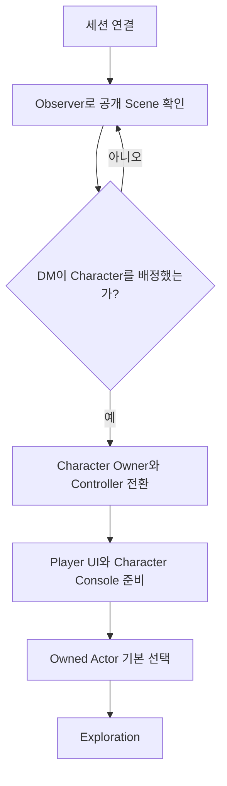
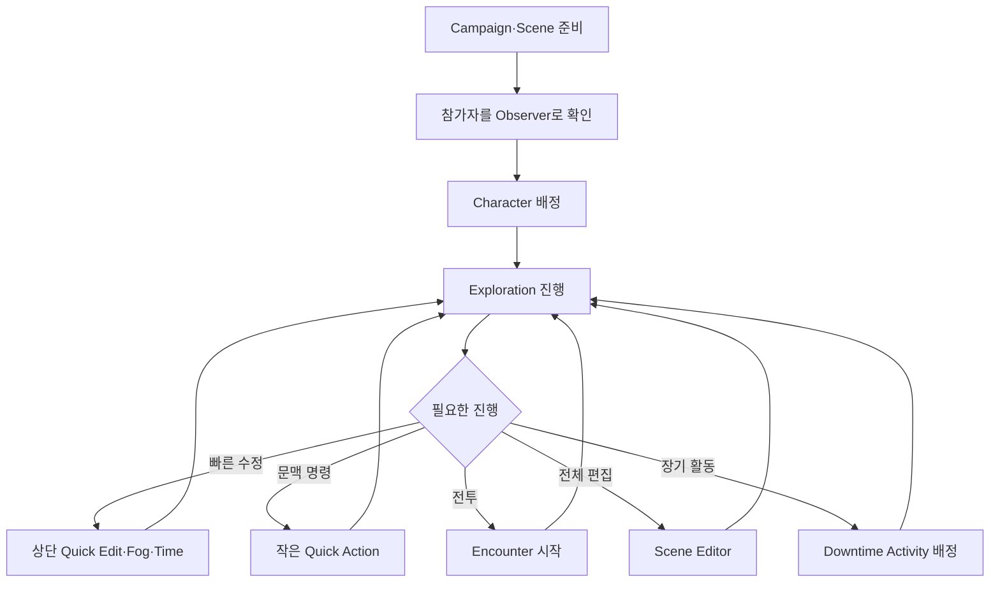

# RVTT 한눈에 보는 세션 흐름

- 사용자 가이드 상태: `TARGET_EXPERIENCE`
- 대상: Player, Observer, DM
- 최종 갱신일: 2026-08-06
- HTML 화면: [`html/index.html`](html/index.html)

## 1. 30초 요약

```text
DM이 Campaign과 시작 Scene을 준비한다
→ 참가자는 Observer로 세션에 들어온다
→ DM이 참가자에게 Character를 배정한다
→ 참가자가 해당 Character의 Owner·Controller가 된다
→ Player Character Actor가 기본 선택된다
→ 탐험한다
→ 필요하면 전투한다
→ 전투가 끝나면 같은 Scene에서 탐험을 계속한다
→ DM이 Scene 전환·Downtime·종료를 결정한다
```

## 2. Player 참가



Character를 Player가 직접 선택하지 않는다. Character가 배정되기 전에는 관전과 공개 문서 확인만 가능하다.

## 3. 직접 플레이

```text
하단 Character Console
→ 현재 Character, HP, 상태, 행동, 주문, 아이템과 자원

Left Click
→ 보이는 기본 행동

Right Click
→ 작은 세로 Action Menu

Q
→ 현재 문맥 하나 취소

E
→ 현재 Confirm 하나 실행
```

Objective·Map·Minimap 화면은 사용하지 않는다.

## 4. 주사위

```text
서버가 결과를 봉인
→ 화면에서 물리 주사위가 굴러감
→ 주사위가 멈춤
→ 상단 투명 Notice에 결과 표시
→ 명중·피해·판정 결과가 전장에 반영
```

## 5. Character 정보

```text
Official Sheet View
→ 공식 D&D 시트형 정보 구조로 전체 수치 확인

VTT Management View
→ 장비·Inventory·Action·Spell을 게임형 화면에서 관리
```

두 화면은 같은 Character 상태를 사용한다.

## 6. DM 흐름



## 7. 재접속

```text
연결 복구
→ Session 확인
→ Owner·Role 확인
→ Player 또는 Observer Projection 재구성
→ Owned Actor와 Character Console 복구
→ 입력 재개
```
