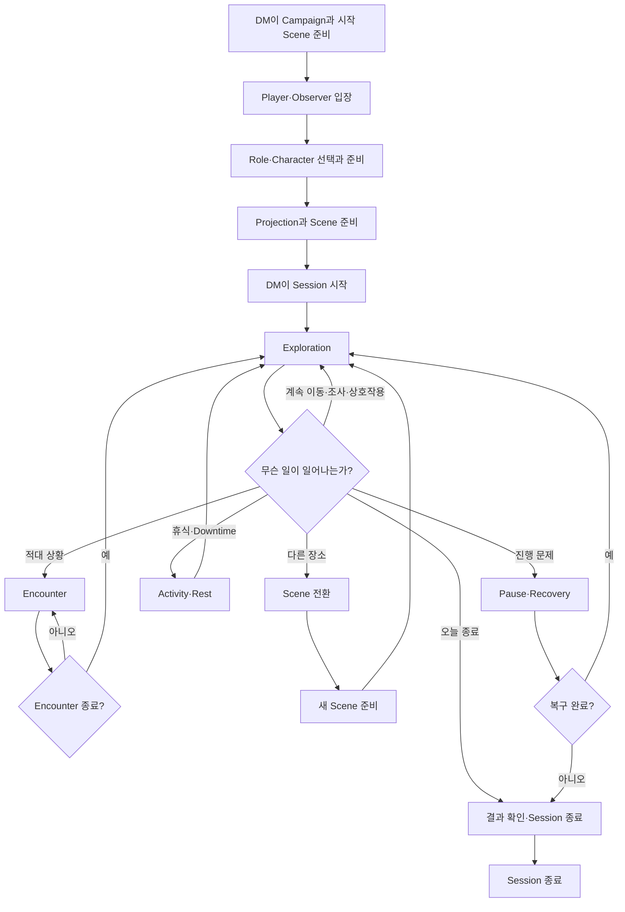
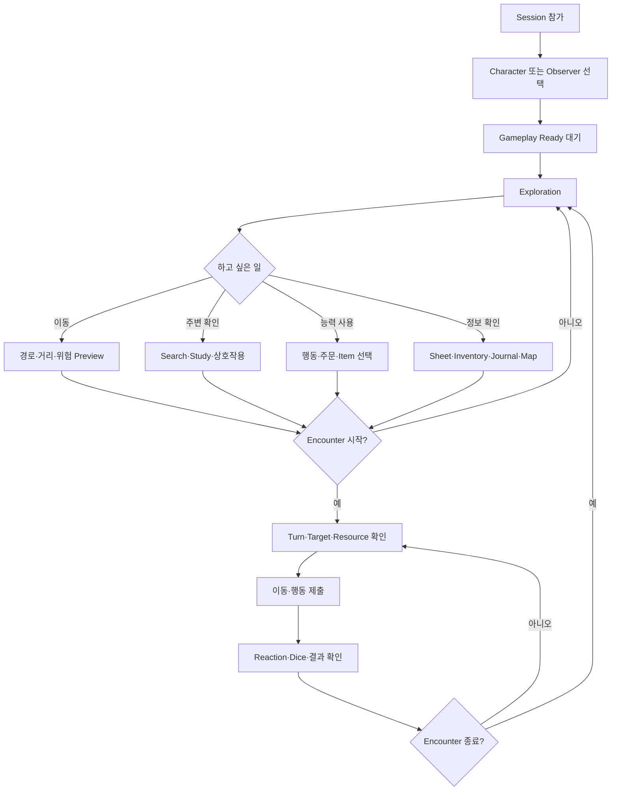
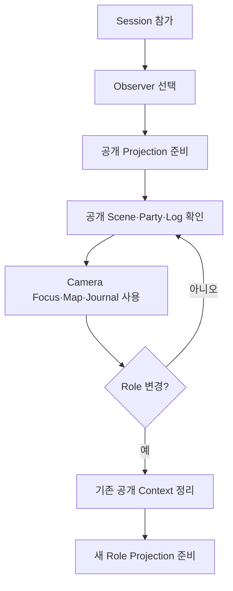
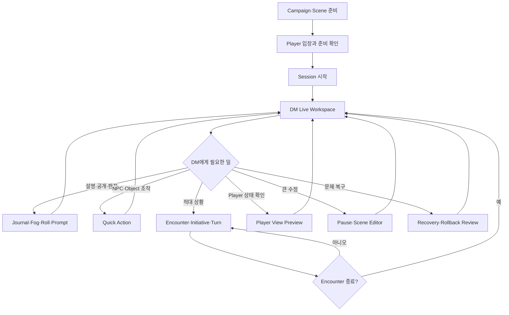
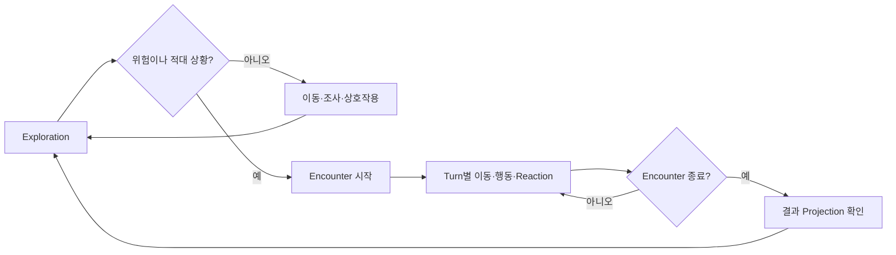
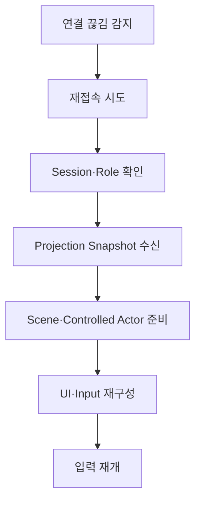
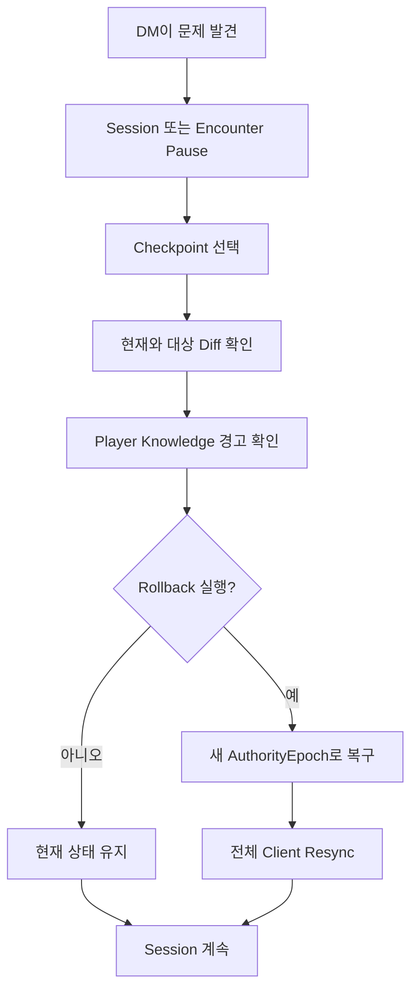

# RVTT 한눈에 보는 세션 흐름

- 사용자 가이드 상태: `TARGET_EXPERIENCE`
- 대상: Player, DM, Observer
- 최종 갱신일: 2026-08-06
- 전체 UI HTML 예시: [`html/index.html`](html/index.html)
- Player Guide: [`player/README.md`](player/README.md)
- Player·Observer 화면 지도: [`player/UI-EXAMPLES.md`](player/UI-EXAMPLES.md)
- DM Guide: [`dm/README.md`](dm/README.md)
- DM 화면 지도: [`dm/UI-EXAMPLES.md`](dm/UI-EXAMPLES.md)

> 이 문서는 구현 전 목표 사용자 경험을 간단하게 보여 준다. 각 단계의 화면은 연결된 HTML 예시에서 확인한다. HTML은 Roblox Runtime Evidence가 아니다.

## 1. 30초 요약

```text
DM이 Campaign과 시작 Scene을 준비한다
→ Player가 Character를 선택하고 준비한다
→ DM이 Session을 시작한다
→ 함께 Exploration을 진행한다
→ 필요하면 Encounter를 진행한다
→ Encounter가 끝나면 같은 Scene의 Exploration으로 돌아간다
→ Scene을 전환하거나 Session을 종료한다
```

관련 화면:

- [`세션 참가·Character 선택`](html/index.html#session-entry)
- [`Exploration HUD`](html/index.html#exploration)
- [`Encounter HUD`](html/index.html#encounter)
- [`DM Live Workspace`](html/index.html#dm-live)

## 2. 공통 입력

```text
Left Click
→ 선택 또는 클릭 전에 표시된 기본 행동

Right Click
→ Capability 기반 Context Action Table

Middle-button Drag
→ Camera Orbit

WASD
→ Camera 기준 평면 이동

Wheel
→ Camera Zoom

Ctrl+Wheel
→ Camera Pivot Y

F 또는 Space
→ 선택 Actor Frame

Q
→ 최상위 Context 하나만 취소·닫기·거절

E
→ 현재 화면에 표시된 Confirm 하나 제출

1–5
→ 현재 Label이 보이는 주요 선택지

ESC
→ Gameplay 의미 없음
```

관련 화면:

- [`Context Action Table`](html/index.html#context-actions)
- [`이동 경로 Preview`](html/index.html#movement-preview)
- [`Tooltip·Toast·Component 상태`](html/index.html#component-states)

## 3. 전체 Session 흐름



## 4. Player 흐름



관련 화면:

- [`Movement Preview`](html/index.html#movement-preview)
- [`Targeting`](html/index.html#targeting)
- [`Reaction Prompt`](html/index.html#reaction)
- [`Dice Result`](html/index.html#dice)
- [`Character Sheet`](html/index.html#character-sheet)
- [`Inventory`](html/index.html#inventory)
- [`Journal`](html/index.html#journal)
- [`Map`](html/index.html#map)

### Player가 기억할 것

- 클릭 전에 World Action Label, 경로, 범위와 비용을 확인한다.
- 사용 가능한 행동과 권한에는 있지만 현재 불가능한 행동을 구분한다.
- 권한에 없는 행동과 미인지 정보는 화면에 자리도 나타나지 않는다.
- Pending은 제출됐다는 표시이며 성공 확정이 아니다.
- 이동·공격·상호작용 뒤 행동 주체 Actor 선택은 유지된다.
- Turn이 바뀌어도 Camera를 강제로 빼앗지 않는다.

## 5. Observer 흐름



관련 화면: [`Observer 공개 HUD`](html/index.html#observer)

Observer에게는 이동·공격·Item 사용 Action Hotbar와 권한 밖 행동 자리를 제공하지 않는다.

## 6. DM 흐름



관련 화면:

- [`DM Live Workspace`](html/index.html#dm-live)
- [`DM Quick Action`](html/index.html#dm-quick)
- [`Encounter·Fog Control`](html/index.html#dm-encounter)
- [`Player View Preview`](html/index.html#player-preview)
- [`Scene Editor`](html/index.html#scene-editor)
- [`Rollback Review`](html/index.html#rollback)

### DM이 기억할 것

- Player Route와 DM Override를 시각적으로 구분한다.
- 위험한 Override는 대상·공개 범위·영향과 Audit을 확인한다.
- Player View Preview는 Player의 Camera·Selection·Control Assignment를 바꾸지 않는다.
- Scene Source, Candidate, Published와 Live Runtime을 같은 상태로 표현하지 않는다.
- Rollback 전에 Diff와 Player Knowledge 경고를 확인한다.

## 7. Exploration과 Encounter 반복



Encounter가 시작될 때 다른 전투 화면으로 Scene을 새로 불러오지 않는다. 기존 위치와 Object 상태를 유지한 채 Initiative·Turn Resource·End Turn UI가 추가된다.

## 8. Character·Inventory·Rest

```text
Character 상태 확인
→ Sheet·Inventory·Equipment
→ 필요하면 Loot·Transfer
→ Downtime·Rest Proposal
→ 비용·참가자·회복 Preview
→ E 제출
→ Server Result와 Projection 확인
```

관련 화면:

- [`Character Sheet`](html/index.html#character-sheet)
- [`Inventory·Equipment`](html/index.html#inventory)
- [`Loot·Transfer`](html/index.html#loot)
- [`Downtime·Rest`](html/index.html#downtime)
- [`HP 0·Death Save`](html/index.html#death-save)

HP 0은 전체 화면 Game Over로 처리하지 않는다. Party 상태, Camera와 현재 허용된 Death Save·Reaction·정보 행동을 유지한다.

## 9. Settings

```text
System Button 또는 OpenSystemMenu
→ Interface·Gameplay UX·Camera·Accessibility·Bindings
→ 즉시 Preview
→ 저장 또는 Category Reset
```

관련 화면:

- [`Interface Settings`](html/index.html#settings-interface)
- [`Camera·Accessibility`](html/index.html#settings-accessibility)
- [`Binding Conflict`](html/index.html#binding-conflict)
- [`System Menu`](html/index.html#system-menu)

기본 Accent는 Gold다. UI·Camera·Accessibility 설정 변경이 Selection·Pending·Modal·Input Context를 초기화하지 않는다.

## 10. 연결이 끊겼을 때



관련 화면: [`Reconnect·Resync·Recovery`](html/index.html#reconnect)

- 단순 Spinner 대신 현재 성공 단계와 실패 단계를 표시한다.
- Last Known Good 화면을 읽을 수 있어도 Authority 입력은 Gate한다.
- 이전 ConnectionEpoch·AuthorityEpoch의 Prompt·Selection·ACK를 재사용하지 않는다.
- Accent·UI Scale·접근성·Camera Preference는 유지한다.

## 11. DM이 이전 상태로 되돌릴 때



관련 화면: [`DM Recovery·Rollback Review`](html/index.html#rollback)

## 12. 역할 한 줄 정리

| 역할 | 세션에서 하는 일 | 화면 예시 |
|---|---|---|
| Player | Character를 선택하고 이동·조사·행동·전투·Item 관리를 수행한다. | [`Player UI`](player/UI-EXAMPLES.md) |
| Observer | 공개된 진행과 정보를 보며 Camera·Map·Journal을 사용한다. | [`Observer HUD`](html/index.html#observer) |
| DM | Scene, 정보 공개, 판정, NPC, Encounter, 저작과 복구를 관리한다. | [`DM UI`](dm/UI-EXAMPLES.md) |

## 13. 검증 상태

```text
Quick Flow
→ TARGET EXPERIENCE

HTML UI Examples
→ STATIC COVERAGE COMPLETE · 28 SCREENS

Roblox Studio Runtime
→ NOT EXECUTED

Release Screenshot Verification
→ NOT EXECUTED
```
