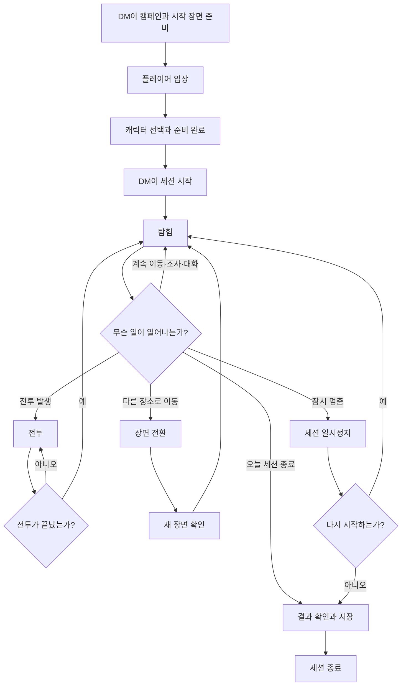
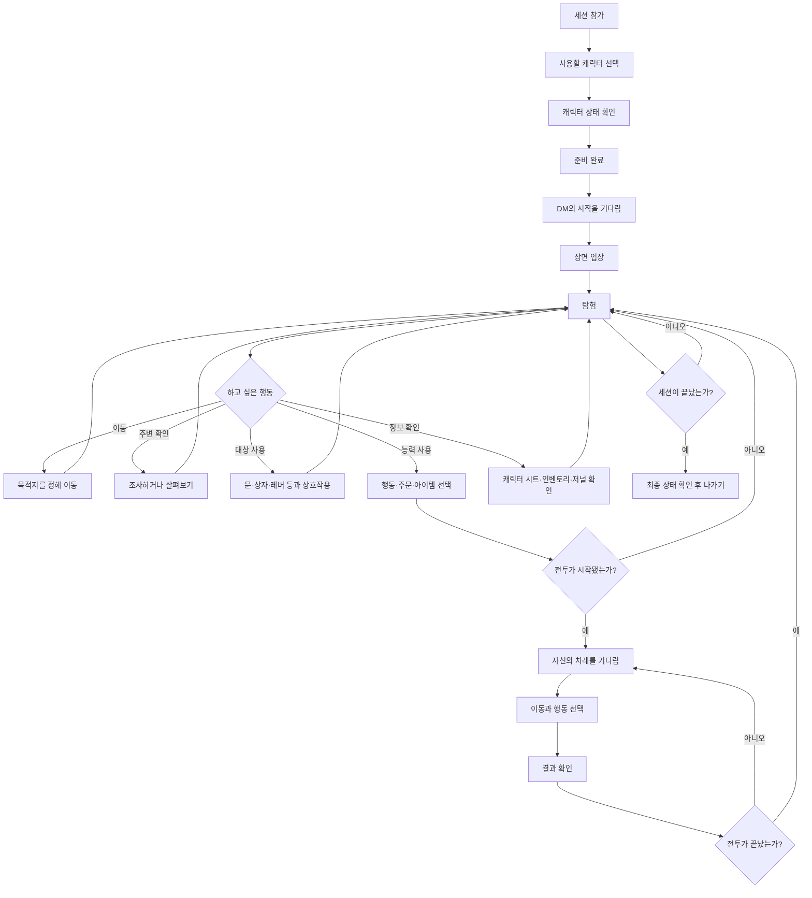
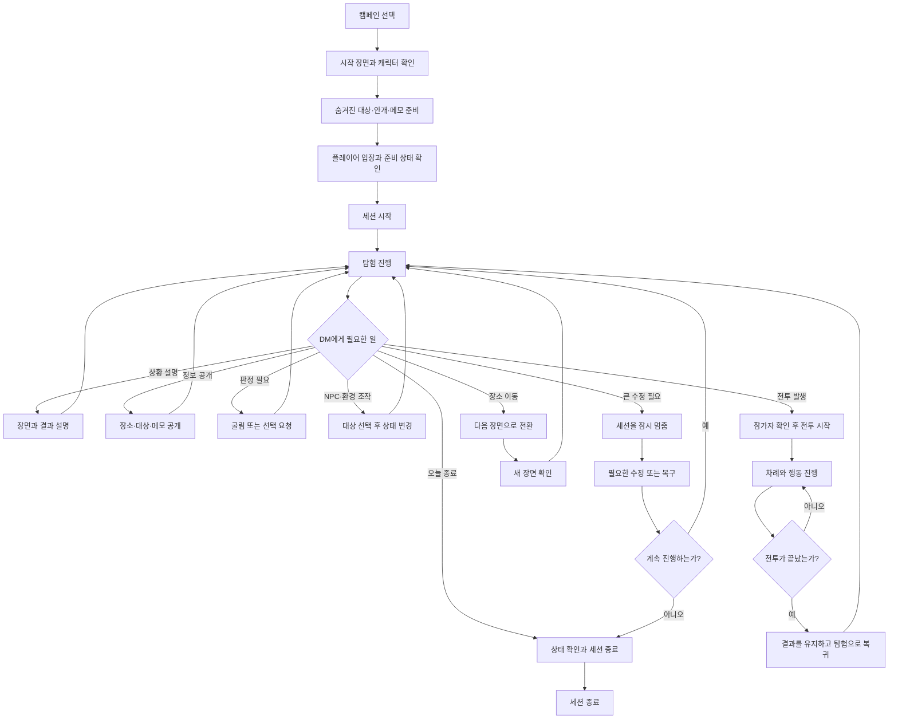
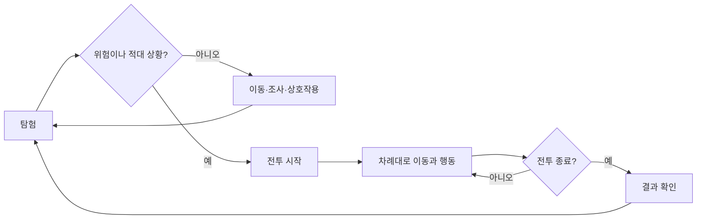
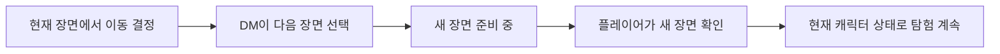
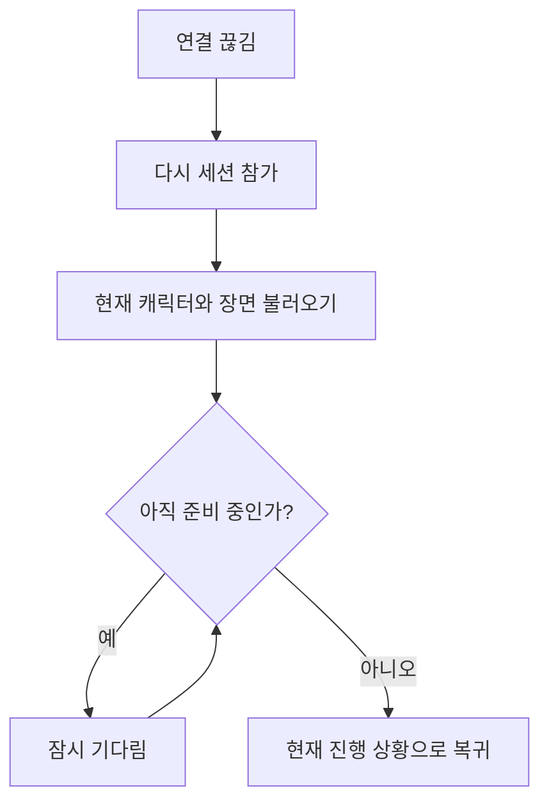
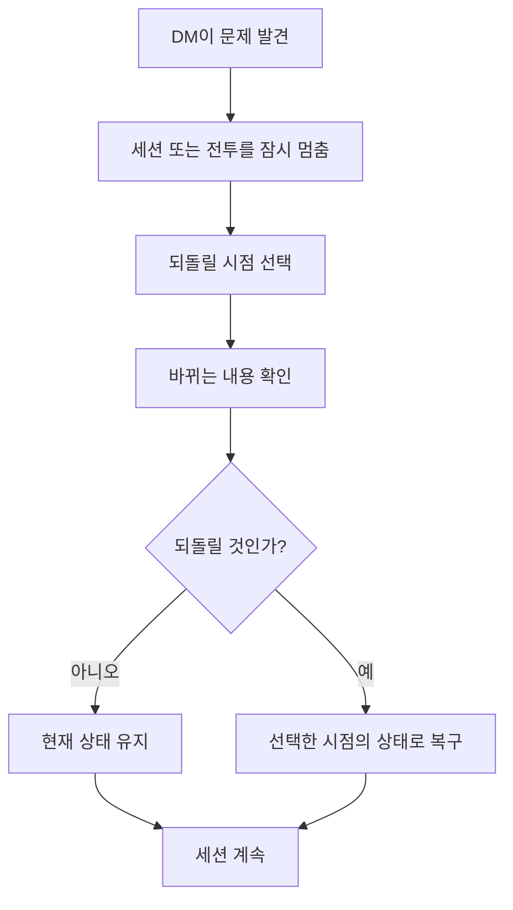

# RVTT 한눈에 보는 세션 흐름

- 사용자 가이드 상태: `TARGET_EXPERIENCE`
- 대상: Player, DM, Observer
- 최종 갱신일: 2026-08-05
- 상세 Player Guide: [`player/README.md`](player/README.md)
- 상세 DM Guide: [`dm/README.md`](dm/README.md)

> 이 문서는 구현 전 목표 사용자 경험을 가장 간단하게 보여 준다. 코딩 구조나 내부 시스템은 설명하지 않는다.

## 1. 30초 요약

```text
DM이 캠페인과 장면을 준비한다
→ 플레이어가 캐릭터를 선택하고 준비한다
→ DM이 세션을 시작한다
→ 함께 탐험한다
→ 필요하면 전투한다
→ 전투가 끝나면 다시 탐험한다
→ 다른 장면으로 이동하거나 세션을 끝낸다
```

RVTT의 기본 세션은 **탐험을 중심으로 진행되며, 전투와 장면 전환이 그 사이에 들어오는 구조**다.

---

## 2. 전체 세션 흐름



핵심은 다음과 같다.

- 탐험과 전투는 서로 다른 게임이 아니라 같은 세션의 두 진행 방식이다.
- 전투가 끝나도 캐릭터와 주변 상태를 유지한 채 탐험으로 돌아간다.
- 장면이 바뀌어도 세션은 계속 이어진다.
- DM은 필요할 때 세션을 멈추거나 종료할 수 있다.

---

## 3. 플레이어 흐름



### 플레이어가 기억할 것

```text
탐험
→ 자유롭게 이동하고 조사한다

전투
→ 자신의 차례에 이동과 행동을 정한다

Q
→ 지금 하던 선택을 취소하거나 한 단계 돌아간다

E
→ 현재 선택을 확정하거나 대상과 상호작용한다
```

탐험에서는 캐릭터를 클릭 또는 WASD로 이동할 수 있다. 전투에서는 경로를 확인한 뒤 목적지를 클릭해 이동하며, WASD는 카메라 이동에 사용한다.

---

## 4. DM 흐름



### DM이 기억할 것

```text
세션 전
→ 장면·캐릭터·숨겨진 정보를 준비한다

탐험 중
→ 설명·공개·판정·NPC와 환경을 관리한다

전투 중
→ 참가자·차례·행동과 결과를 진행한다

큰 수정이 필요할 때
→ 먼저 세션을 멈추고 수정한 뒤 다시 시작한다
```

DM은 플레이어와 같은 장면 위에서 진행하지만, 숨겨진 정보와 추가 진행 도구를 함께 사용한다.

---

## 5. 탐험과 전투의 반복



전투가 시작될 때 장면을 새로 불러오지 않는다. 탐험 중이던 위치와 주변 상태에서 그대로 전투가 시작되고, 끝난 뒤 같은 장소에서 탐험을 계속한다.

---

## 6. 장면 전환



장면 전환은 다른 장소로 이동하는 것이다. 캐릭터의 HP, 자원, 장비와 계속 유지되어야 하는 효과는 그대로 이어진다.

---

## 7. 연결이 끊겼을 때



다시 들어왔을 때 이전 화면이 잠시 보이더라도 바로 조작하지 않는다. 현재 장면과 캐릭터 상태를 모두 불러왔다는 안내가 나온 뒤 플레이를 계속한다.

---

## 8. DM이 이전 상태로 되돌릴 때



되돌리기는 실수나 진행 문제를 바로잡기 위한 DM 기능이다. 플레이어는 복구가 끝난 뒤 현재 캐릭터와 장면 상태를 다시 확인하고 플레이를 이어 간다.

---

## 9. 가장 짧은 역할 정리

| 역할 | 세션에서 하는 일 |
|---|---|
| Player | 캐릭터를 선택하고 이동·조사·행동·전투를 수행한다. |
| Observer | 공개된 진행을 보지만 캐릭터를 직접 조작하지 않는다. |
| DM | 장면, 정보 공개, 판정, NPC, 전투와 세션 흐름을 관리한다. |

더 자세한 조작과 상황별 설명은 [`Player Guide`](player/README.md)와 [`DM Guide`](dm/README.md)에서 확인한다.
